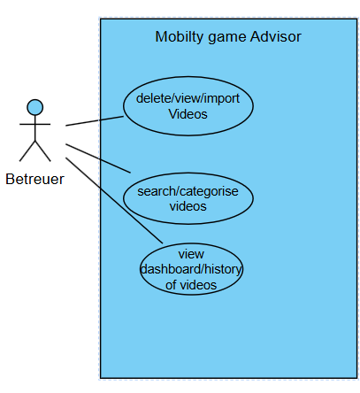

Mobility-Games-Advisor
---
## 1.1. Ausgangssituation  
- Viele Menschen mit körperlichen oder kognitiven Beeinträchtigungen (insbesondere ältere Personen) wollen fitter werden. Um diese zu verbessern müssen sie regelmäßig Übungen machen.
  
## 1.2 Istzustand
- Übungen und Bewegungsspiele gibt es zwar, sind jedoch unstrukturiert und über viele Plattformen verteilt (z. B. YouTube, TikTok,...).  
- Inhalte unterscheiden sich stark in Qualität, Verständlichkeit und der Zielgruppe.  
- Es gibt keine zentrale Anwendung, die Übungen nach Fähigkeiten, Einschränkungen oder Zielen aufteilt und aufbereitet.  
- Fortschritte oder bereits absolvierte Übungen werden aktuell nicht dokumentiert und ausgewertet.
# 1.2.1. Marktanalyse
- Es gibt keine Plattform die genau das anbietet was wir wollen.
# 1.2.2 Klassifikation für Übungen und Aktivitäten
- Motorische Fähigkeiten
   - Kraft, Ausdauer, Koordination, Beweglichkeit, Feinmotorik,
- Kognitive Fähigkeiten
   - Merkfähigkeit, Konzentration, Problemlösung, Kreativität
- Sozial-emotionale Fähigkeiten
   - Kommunikation, Empathie, Selbstbewusstsein, Selbstregulation
## 1.3. Problemstellung  
- Betroffene Personen und Betreuungspersonen haben Schwierigkeiten, passende Übungen für spezifische körperliche oder kognitive Defizite zu finden.  
- Die vorhandenen Inhalte sind unübersichtlich, nicht zielgruppengerecht aufbereitet und sehr zeitaufwendig zu durchsuchen.  
- Es fehlt eine strukturierte Empfehlung, welche Übungen sinnvoll, sicher und an dem einzelen Individum angepasst sind sind.  
- Ohne History/Tracking ist der eigene Fortschritt unübersichtlich und man verliert vielleicht auch die Motivation dafür.
## 1.4. Aufgabenstellung  
- Entwicklung einer zentralen Anwendung („Mobility Games Advisor“), die Übungen und Spiele strukturiert verwaltet.  
- Die Anwendung soll Nutzer gezielt bei der Auswahl geeigneter Übungen unterstützen.  
- Übungen sollen verständlich beschrieben und leicht zugänglich sein.  

### 1.4.1. Funktionale Anforderungen
- Einteilung in Bereiche wie Merkfähigkeit, Mobilität.
- Speicherung durchgeführter Übungen (Tracking).
- Suche von Übungen
- Dashboard und Kategorien von Übungen wie zum Beispiel: Kognition und Gedächtnis oder Beweglichkeit
### 1.4.2 Usecase-diagramm

### 1.4.3. Nichtfunktionale Anforderungen (NFA)
- **Einfache Sprache:** Leicht verständlich für alle Nutzer.
- **Benutzerfreundlichkeit:** Simples Design ("Keep it simple").
## 1.5. Ziele
1. Die Betreuer sollen eine klare Übersicht über die Übungen kriegen, mit dieser Übersicht können sie leicht die passenden Übungen für die Betreuten auswählen. Dazu soll es auch möglich sein dass der Betreuer die Übungen nach Kategorien filtern kann. Er kann auch selbst Videos hochladen, löschen und auch eigen Kategorien erstellen kann, falls die nötigen nicht existieren.

## 1.6. Mengengerüst
### Benutzer
- **Übungsdatenbank:** ca. 20-30 Übungen (Text, Bilder, Links zu Videos)
- **Tracking-Daten:** Historie der durchgeführten Übungen (wächst linear mit Nutzung)
## 1.7. Rahmenbedingungen
### Technisch
- **Desktop-App:** Muss auf Desktop funktionieren.
- **Frontend:** JavaFX.
- **Backend:** Java.

